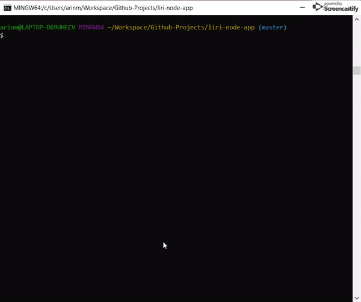

# Liri Bot
At its core, Liri app will help you find information about songs, concerts, and movies.

**Welcome!**

Liri is like iPhone's SIRI. Unlike Siri that is a Speech Interpretation and Recognition Interface, Liri will be a Language Interpretation and Recognition Interface. Liri will be a command line node app that takes in parameters and gives back data to the user.

## DEMO



## Screenshots


## Before we begin
Languages and tools used: Javascript, Node.js, NPM, Moment.js, DotENV

For this app, we will utilize 3 APIs:

* Node-Spotify-API (to search songs)
* Bands In Town API (for concert lookup)
* OMDB API (to search movies)
## Before you run the app
### Check that you have node and npm installed
Visit  https://www.npmjs.com/get-npm

To check if you have Node.js installed, run this command in your terminal:

```
node -v
```

To confirm that you have npm installed you can run this command in your terminal:

```
npm -v
```


## Installation
1. Download (clone) the app.
2. In the root of the app folder, create a file named ' .env ' and add the following to it:
	>	Before proceeding, make sure you have signed up for the 3 APIs above.
  
  ```
     #Spotify API keys
     SPOTIFY_ID = 'YOUR-SPOTIFY-ID'
     SPOTIFY_SECRET = 'YOUR-SPOTIFY-SECRET'
        
     #Bands In Town API keys
     BIT_ID = ' Bands in Town API goes-here ' 
   ````
   
   
   ##  How to use the app
| To get ...              | Command required  ( Disregard ' ' or < > )               |
|-------------------------|----------------------------------------------------------|
| concert information     | node liri.js 'concert-this1 <'artist/band name'>         |
| info. about a song      | node liri.js 'spotify-this-song' <'song', 'artist/band'> |
| a movie's info.         | node liri.js 'movie-this' <'movie title'>                |
| To let app randomly run | node liri.js 'do-what-it-says'                           |
| instructions            | node liri.js help  -OR-  node liri.js                    |
  ##  Good to know
Q: What happens if no command is given as such **node liri.js** or **node liri.js** help?
A: It will show welcome page and instructions.

Q: What does command **do-what-it-says** do?
A: The app will read 'random.txt' in case no command is given. If you change the default information of **spotify-this-song,"I want it that Way"** to another command, make sure there is no space. If you replace the text with 'movie-this,"movie-title-of-your-choice" the app will return information about that particular movie.

Q. What if you don't enter any movie title? 
A: App will use the default movie title "Mr. Nobody" to perform the search.

Q. What if you forget to type a band name after 'concert-this' command?
A: The app will use "Yanni" for the artist name to search for concert details.

Q: What happens if you don't enter a song name?
A: App will perform the search using the default **the sign, the ace of base**.
